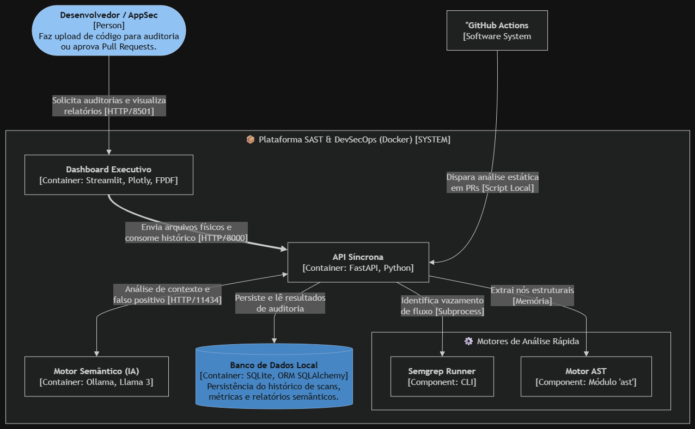

<div align="center">
  
  <h1>🛡️ Motor SAST & DevSecOps</h1>
  <p><em>Análise Estática de Segurança e Rastreamento de Vulnerabilidades</em></p>
  <p>
    
    
    
    
    
    
    
  </p>
  <p>
    <b>Status do Projeto:</b> ✅ Plataforma V3.0 (100% Funcional) | Checkpoints 1, 2 e 3 Concluídos
  </p>
</div>

---

## 📝 Descrição do Projeto

A **Plataforma SAST & DevSecOps** é um motor de análise estática de segurança focado em auditoria de código-fonte Python. O projeto tem como missão aplicar a cultura *Shift-Left*, trazendo a segurança para as fases iniciais do ciclo de desenvolvimento de software (SDLC).

Nossa arquitetura orientada a serviços combina análise estrutural rápida (AST), rastreamento avançado de fluxo de dados (Semgrep) e uma camada de **Inteligência Artificial (Llama 3)** operando localmente para validação semântica, redução de falsos positivos e geração automatizada de blocos de código corrigidos (Remediation Advice). Tudo isso centralizado em um Dashboard Executivo interativo e orquestrado por pipelines de CI/CD.

---

## 🏛️ Arquitetura do Sistema (C4 Model)

> *O diagrama abaixo ilustra a arquitetura técnica conteinerizada da plataforma, detalhando a comunicação entre o frontend, a API síncrona, o banco de dados e os múltiplos motores de análise.*



---

## ✨ Principais Funcionalidades

* ✅ **Parsing Estrutural (AST):** Conversão de código-fonte em nós de sintaxe abstrata para detecção instantânea de segredos e injeções de código (`eval`, `exec`).
* ✅ **Taint Analysis (Semgrep):** Rastreamento de fluxo de dados para identificar se entradas não sanitizadas alcançam funções sensíveis.
* ✅ **Análise Semântica (IA Local):** Uso de LLM isolado para classificar a severidade real, justificar falsos positivos e gerar sugestões de correção diretamente em código.
* ✅ **Persistência de Dados (SQLite):** Histórico completo das auditorias armazenado via SQLAlchemy, com segurança garantida pelo isolamento no `.gitignore`.
* ✅ **Dashboard Executivo (Streamlit):** Visualização rica dividida em abas contendo análise interativa, exportação de laudos em PDF baseados em HTML, e gráficos de Severidade, Categorias e Tendência de Falhas.
* ✅ **Security Gates (CI/CD):** Integração com GitHub Actions executando varreduras híbridas que bloqueiam *Pull Requests* com vulnerabilidades críticas.

---

## 🛠️ Tecnologias Utilizadas

| Componente | Tecnologia Recomendada |
| --- | --- |
| **Backend & API** | Python 3.11, FastAPI, SQLAlchemy, SQLite |
| **Interface Visual** | Streamlit, Plotly (Gráficos), FPDF2 (Relatórios) |
| **Motores de Análise** | Módulo nativo `ast`, Semgrep |
| **Inteligência Artificial** | Ollama rodando localmente com modelo Llama 3 |
| **DevSecOps** | Docker, Docker Compose, GitHub Actions (CI/CD) |

---

## 🚀 Como Instalar e Rodar o Projeto

Siga os passos abaixo para subir a infraestrutura completa do SAST na sua máquina.

### 📋 Pré-requisitos

* Docker e Docker Compose instalados.
* Git.

### 🔧 Instalação e Execução

1. **Clone o repositório**
```bash
git clone https://github.com/challengelotus/checkpoint4-cyber-sast-platform.git
cd checkpoint4-cyber-sast-platform
```

2. **Suba os containers com o Docker Compose**
```bash
docker compose up --build -d
```

3. **Baixe o Modelo de IA (Apenas na Primeira Execução)**
Acesse o shell do container do Ollama e faça o download do Llama 3:
```bash
docker exec -it <nome_do_container_ollama> ollama run llama3
```
*(Digite `/bye` para sair após a conclusão).*

---

## 💡 Como Usar (Guia da Versão 3.0)

Em vez de usar APIs via texto, a V3.0 possui uma interface gráfica completa focada na experiência do usuário e relatórios visuais:

1. Acesse o **Dashboard Executivo** pelo navegador: `http://localhost:8501`.
2. Na aba **🔍 Auditoria de Código**, clique em "Browse files" e envie um arquivo Python (`.py`) vulnerável (ex: os arquivos localizados na pasta `tests/` do projeto).
3. Clique em **Executar Motor SAST**.
4. Aguarde a orquestração (AST + Semgrep + Llama 3). O relatório será renderizado na tela contendo os *Cards* de vulnerabilidade e o parecer do Engenheiro de IA. Você pode exportar o laudo clicando em **Baixar Relatório em PDF**.
5. Acesse a aba **📈 Dashboard Executivo** para visualizar as métricas globais do projeto (Gráfico de Rosca, Falhas Detectadas e Linha de Tendência).

---

## 👥 Equipe de Desenvolvimento

Projeto desenvolvido para a disciplina de Cybersecurity na Engenharia de Software.

| Integrante | RM | Responsabilidade Principal |
| --- | --- | --- |
| **João Victor Soave** | RM557595 | Arquiteto de Software e Desenvolvedor Backend |
| **Maria Alice Freitas Araújo** | RM557516 | QA e Especialista em Testes/Segurança |
| **Pedro Henrique Mendes dos Santos** | RM555332 | Desenvolvedor Backend / LLM Integration |
| **Rafael Teofilo Lucena** | RM555600 | Arquiteto de Infraestrutura e Diagramação (C4) |
| **Vinícius Fernandes Tavares Bittencourt** | RM558909 | Engenheiro DevOps / Docker |

---

## 📄 Licença e Ética

Projeto acadêmico. Este repositório está licenciado sob a **MIT License**.
