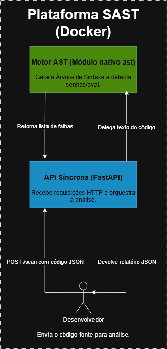

<div align="center">
  
  <h1>🛡️ Motor SAST & DevSecOps</h1>
  <p><em>Análise Estática de Segurança e Rastreamento de Vulnerabilidades</em></p>
  <p>
    
    
    
    
    
    
  </p>
  <p>
    <b>Status do Projeto:</b> ✅ Checkpoint 1 Concluído | ✅ Checkpoint 2 Concluído | 🚧 Checkpoint 3 em andamento
  </p>
</div>

---

## 📝 Descrição do Projeto

A **Plataforma SAST & DevSecOps** é um motor de análise estática de segurança focado em auditoria de código-fonte Python. O projeto tem como missão aplicar a cultura *Shift-Left*, trazendo a segurança para as fases iniciais do ciclo de desenvolvimento de software (SDLC).

Em vez de depender de expressões regulares (Regex) falhas, nossa plataforma utiliza o módulo nativo `ast` do Python para construir uma **Árvore de Sintaxe Abstrata (AST)**, permitindo uma inspeção estrutural profunda. Essa fundação é ampliada por um motor de **Taint Analysis** e uma camada de **Inteligência Artificial (Llama 3)** para validação semântica e correção automatizada.

---

## 🏛️ Arquitetura do Sistema (C4 Model)

> *O diagrama abaixo ilustra a arquitetura técnica da plataforma, detalhando a comunicação entre a API Síncrona (FastAPI) e os Motores de Análise dentro do ambiente conteinerizado.*

<div align="center">
  
  <p><i>Arquitetura Nível 2 (Container)</i></p>
</div>

---

## ✨ Principais Funcionalidades

- ✅ **Parsing Estrutural (AST):** Conversão de código-fonte em nós de sintaxe abstrata para detecção de senhas hardcoded e funções perigosas (`eval`, `exec`).
- ✅ **Taint Analysis (Semgrep):** Rastreamento de fluxo de dados para identificar se entradas não sanitizadas alcançam funções sensíveis (sinks).
- ✅ **Análise Semântica (IA Local):** Uso do modelo Llama 3 (via Ollama) para classificar a severidade real das falhas, reduzir falsos positivos em lógicas complexas e gerar sugestões automatizadas de correção (Remediation Advice).
- ✅ **Ambiente Conteinerizado:** Setup plug-and-play de toda a stack utilizando Docker e Docker Compose.
- 🚧 *Em breve (Checkpoint 3): Implementação de Security Gates em pipelines CI/CD (GitHub Actions) para bloqueio de Pull Requests inseguros.*
- 🚧 *Em breve (Checkpoint 3): Desenvolvimento de Dashboard Executivo para visualização de métricas por arquivo, linha e severidade.*

---

## 🛠️ Tecnologias Utilizadas

| Ferramenta | Finalidade |
| :--- | :--- |
| **Python 3.11** | Linguagem base da aplicação e alvo principal do SAST. |
| **FastAPI** | Framework moderno para construção e exposição da API. |
| **Módulo nativo `ast`** | Geração e navegação pelos nós da Árvore de Sintaxe Abstrata. |
| **Semgrep** | Motor secundário utilizado exclusivamente para validação de Taint Analysis. |
| **Docker & Compose** | Orquestração, conteinerização e padronização do ambiente local. |
| **Ollama (Llama 3)** | Integração de LLM local para análise semântica sem vazamento de dados corporativos. |

---

## 🚀 Como Instalar e Rodar o Projeto

Siga os passos abaixo para subir a infraestrutura completa do SAST na sua máquina.

### 📋 Pré-requisitos

- [Docker](https://docs.docker.com/get-docker/) instalado e rodando.
- [Docker Compose](https://docs.docker.com/compose/install/) configurado.
- [Git](https://git-scm.com/)

### 🔧 Instalação e Execução

1.  **Clone o repositório**
    ```bash
    git clone https://github.com/challengelotus/checkpoint4-cyber-sast-platform.git

    cd checkpoint4-cyber-sast-platform
    ```

2.  **Suba os containers com o Docker Compose**
    ```bash
    docker-compose up --build -d
    ```

3.  **Baixe o Modelo de IA (Primeira Execução)**
    Acesse o shell do container do Ollama e baixe o Llama 3:
    ```bash
    docker exec -it <nome_do_container_ollama> ollama run llama3
    ```
    *(Digite `/bye` para sair após a conclusão do download).*

4.  **Valide o funcionamento**
    - Acesse `http://localhost:8000/docs` para visualizar o **Swagger UI**.

---

## 💡 Como Usar (Guia Básico)

1. Com a aplicação rodando, abra a documentação Swagger no navegador: `http://localhost:8000/docs`.
2. Expanda o endpoint **`POST /api/v1/analyze`** e clique em **"Try it out"**.
3. No corpo da requisição, envie o código Python que deseja auditar. Exemplo com Taint Analysis:
    ```json
      {
        "source_code": "senha_banco = 'admin123'\n\ndef processar_dados():\n        comando_usuario = input('Digite o comando: ')\n    dado_sanitizado = comando_usuario.strip()\n    eval(dado_sanitizado)"
      }
    ```
4. Clique em **Execute**. A API retornará o JSON consolidando as falhas estruturais, o rastreamento de fluxo e o relatório completo do LLM contendo a severidade real e a recomendação de correção.

---

## 👥 Equipe de Desenvolvimento

Projeto desenvolvido para a disciplina de Cybersecurity na Engenharia de Software.

| Integrante | RM | Responsabilidade Principal |
| :--- | :--- | :--- |
| **João Victor Soave** | RM557595 | Arquiteto de Software e Desenvolvedor Backend |
| **Maria Alice Freitas Araújo** | RM557516 | QA e Especialista em Testes/Segurança |
| **Pedro Henrique Mendes dos Santos** | RM555332 | Desenvolvedor Backend / LLM Integration |
| **Rafael Teofilo Lucena** | RM555600 | Arquiteto de Infraestrutura e Diagramação (C4) |
| **Vinícius Fernandes Tavares Bittencourt** | RM558909 | Engenheiro DevOps / Docker |

---

## 📄 Licença

Projeto acadêmico. Este repositório está licenciado sob a **MIT License**.

<div align="center">
  <sub>Desenvolvido de forma ética para fins de educação e segurança defensiva. A análise de código deve respeitar a propriedade intelectual e a privacidade do código-fonte. Utilize apenas repositórios autorizados.</sub>
</div>
